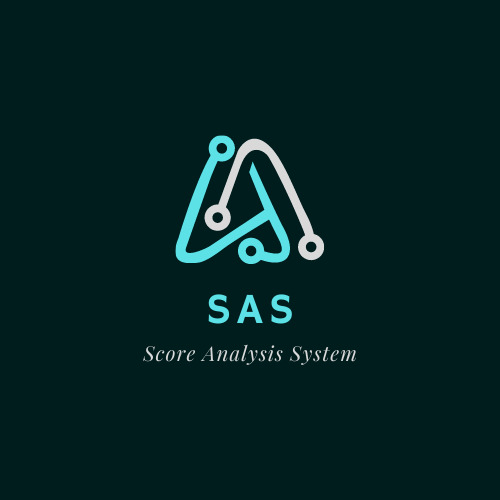
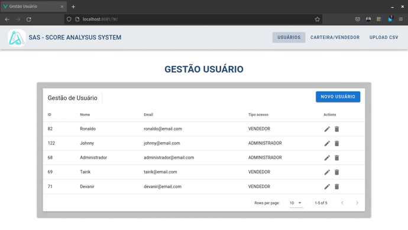
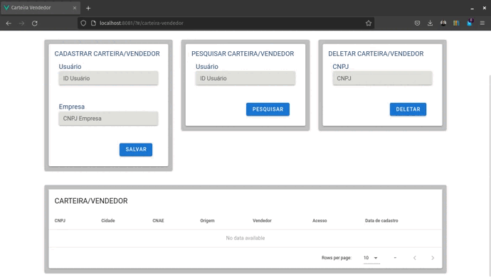
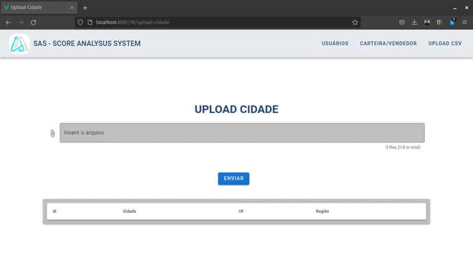

<p align="center">  </p>

<h1 align="center">SAS - Score Analysis System</h1>

<p align="center">
<a href="https://score-analysis-system-front.herokuapp.com/">
  
</a>
</p>

O projeto a ser desenvolvido vai ser um sistema para buscar novas receitas através da criação de novas
segmentações de clientes para a empresa parceira [SPC](https://www.spcbrasil.org.br/).

<p align="center">Front-End</p>
<p align="center">
  

  

  
    
  

   
</p>
<p align="center">Back-End</p>
<p align="center">
  

  

  
    
  
 
  
</p>

<h2 align="center">📋 Tabela de conteúdos</h2>

<!--ts-->
   * [Introdução](#sas---score-analysis-system)
   * [Features](#-features)
   * [Demonstração da aplicação](#-demonstração-da-aplicação)
   * [Projeto](#-projeto)
   * [Desafio](#-desafio)
   * [Entregas](#-entregas)
   * [Rodando o Sistema](#-rodando-o-sistema)
      * [Pré-requisitos](#-pré-requisitos)
      * [Rodando o Front-End](#-rodando-o-front-end)
      * [Rodando o Back-End](#-rodando-o-back-end)
   * [Tecnologias](#-tecnologias)
   * [Membros](#-membros)
   * [Licença](#-licença)
<!--te-->

<h2 align="center">🚧  Sistema 🚀 Em construção...  🚧</h2>

<h2 align="center">✅ Features</h2>

- [x] Gestão de usuários
- [x] Gestão da carteira do vendedor
- [x] Upload CSV da cidade
- [x] Upload CSV do CNAE
- [x] Upload CSV da empresa
- [x] Upload CSV da consumo

<h2 align="center">📺 Demonstração da aplicação</h2>

<p align="center">Demonstração da tela de Gestão de Usuários</p>

<div align="center">



</div>

<p align="center">Demonstração da tela de Gestão da Carteira/Vendedor</p>

<div align="center">



</div>

<p align="center">Demonstração das telas de upload de CSV</p>

<div align="center">



</div>

<h2 align="center">🖥 Projeto</h2>

Projeto realizado em parceria com a SPC que é organização de gestão e inteligência de dados que entrega soluções de crédito, cobrança, antifraude, marketing e certificação digital juntamente com a Faculdade de Tecnologia de São José dos Campos Professor Jessen Vidal.

<h2 align="center">📈 Desafio</h2>

Desafio proposto pela SPC - "Temos um novo desafio na área de vendas que é buscar novas receitas através da criação de novas segmentações de clientes. Para isso precisaremos da criação de novos modelos de dados e indicadores que suportarão as estratégias de vendas (contato com clientes e prospects observando as suas particularidades relacionadas a segmentos, verticais de atuação, consumo e potencial de consumo)."

<h2 align="center">💎 Entregas</h2>

O planejamento e o progresso durante as Sprints do projeto poderá ser visto em [Entregas](https://github.com/API-5-SEMESTRE/documentacao/wiki/Entregas).

<h2 align="center">🚀 Rodando o Sistema</h2>

<h3>📑 Pré-requisitos</h3>

Antes de começar, você vai precisar ter instalado em sua máquina as seguintes ferramentas:
[Git](https://git-scm.com), [Node.js](https://nodejs.org/en/), [NPM](https://www.npmjs.com/), [Vue.js](https://vuejs.org/), [Java 11](https://www.java.com/pt-BR/) e [Maven](https://maven.apache.org/).
Além disto é bom ter um editor para trabalhar com o código como [VSCode](https://code.visualstudio.com/) ou [IntelliJ](https://www.jetbrains.com/pt-br/idea/).

<h3>🎲 Rodando o Front-End</h3>

```bash
# Clone este repositório
$ git clone https://github.com/API-5-SEMESTRE/front-end

# Rodar o camando a seguir no terminal para instalar as dependências do NPM
$ npm install

# Rodar com o comando a seguir para rodar o Front-end
$ npm run serve

# O Front-end está rodando localmente, acesse o link do servidor do Vue.js
```

<h3>🎲 Rodando o Back-End Java</h3>

```bash
# Clone este repositório
$ git clone https://github.com/API-5-SEMESTRE/back-end

# Abrir o arquivo "application.properties" no caminho "src/main/resources/"

# Dentro do arquivo "application.properties", aonde estiver escrito "[URL]" apagar e colocar "jdbc:oracle:thin:@DB202203301935_medium?TNS_ADMIN=./key"

# Exemplo de como deve ficar: spring.datasource.url=jdbc:oracle:thin:@DB202203301935_medium?TNS_ADMIN=./key

# Onde estiver "[USER]" e "[PASSORD]" deve colocar o usuário e a senha

# Salvar o arquivo "application.properties"

# Rodar o arquivo "ApiBackApplicartion.java" no seu editor de código ou IDE

# O Back-end está rodando e o Banco de Dados na Oracle Cloud está conectado
```

<h3>🎲 Rodando o Back-End Python</h3>

```bash
# Clone este repositório
$ git clone https://github.com/API-5-SEMESTRE/back-end-python

# Rodar o camando a seguir no terminal para instalar as dependências do PIP
$ pip install -r requirements.txt

# Rodar com o comando a seguir para rodar o Python
$ python - m flask run ou python3 -m flask run

# O Python está rodando localmente, acesse o link do servidor do Flask
```

<h2 align="center">🛠 Tecnologias</h2>

As seguintes ferramentas foram usadas na construção do projeto:

<p align="center">
<a href="https://vuejs.org/">
  
</a>
<a href="https://www.javascript.com/">
  
</a>
<a href="https://nodejs.org/en/">

</a>
<a href="https://www.npmjs.com/">

</a>
</p>
<p align="center">
<a href="https://www.java.com/pt-BR/">

</a>
<a href="https://maven.apache.org/">

</a>
<a href="https://spring.io/projects/spring-boot">

</a>
</p>
<p align="center">
  <a href="https://www.python.org/">
  
</a>
<a href="https://flask.palletsprojects.com/en/2.1.x/">
  
</a>
<a href="https://pandas.pydata.org/">
  
</a>
<a href="https://pypi.org/project/pip/">
  
</a>
</p>
<p align="center">
  <a href="https://git-scm.com/">
  
</a>
  <a href="https://github.com/">
  
</a>
  <a href="https://www.postman.com/">
  
</a>
</p>
<p align="center">
  <a href="https://www.oracle.com/br/cloud/">

</a>
  <a href="https://www.atlassian.com/br/software/jira">
  
</a>
<a href="https://www.heroku.com/">
  
</a>
</p>

<h2 align="center">👥 Membros</h2>

<table align="center">
    <tr>
        <td align="center">
            <a href="https://linkedin.com/in/tairik-nishimura/">
                
                <br />
                <sub>
                    <b>Tairik Johnny</b>
                </sub>
            </a>
            <br />
            <p>Scrum Master</p>
            <br />
        </td>
        <td align="center">
            <a href="https://www.linkedin.com/in/jeferson-tadeu-das-neves-a98343190/">
                
                <br />
                <sub>
                    <b>Jeferson Neves</b>
                </sub>
            </a>
            <br />
            <p>Product Owner</p>
            <br />
        </td>
        <td align="center">
            <a href="https://linkedin.com/in/devanir-ramos-junior/">
                
                <br />
                <sub>
                    <b>Devanir Ramos</b>
                </sub>
            </a>
            <br />
            <p>Developer</p>
            <br />
        </td>
    </tr>
    <tr>
        <td align="center">
            <a href="https://www.linkedin.com/in/jos%C3%A9-francisco-forneiro-junior/">
                
                <br />
                <sub>
                    <b>José Francisco</b>
                </sub>
            </a>
            <br />
            <p>Developer</p>
            <br />
        </td>
        <td align="center">
            <a href="https://www.linkedin.com/in/gabriel-timoteo-santos/">
                
                <br />
                <sub>
                    <b>Gabriel Timoteo</b>
                </sub>
            </a>
            <br />
            <p>Developer</p>
            <br />
        </td>
        <td align="center">
            <a href="https://www.linkedin.com/in/alan-bezerra/">
                
                <br />
                <sub>
                    <b>Alan Lucas</b>
                </sub>
            </a>
            <br />
            <p>Developer</p>
            <br />
        </td>
    </tr>
</table>

<h2 align="center">📝 Licença</h2>

Todas as informações resultantes da Aprendizagem por Projetos Integrados da Fatec São José dos Campos - Prof. Jessen Vidal seguem a licença Open Source Initiative (OSI) ou Academic Free License 3.0 (AFL-3.0).
